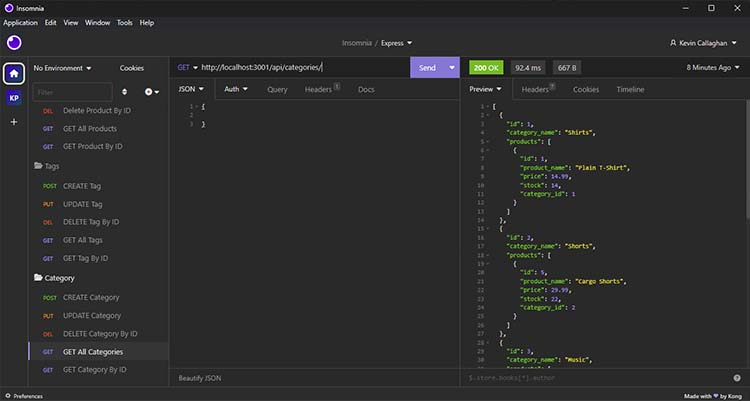

# Run My Store E-Commerce Backend

## Description

This tool allows an E-Commerce business to manage their business backend through a series of API's.  A business can add new products, tags, and categories, and link them all together using their associated ID fields.

## Table of Contents

- [Installation](#installation)
- [Usage](#usage)
- [Credits](#credits)
- [License](#license)

## Installation

Express, mysql2, dotenv, and Sequelize are required to run this program. to run this program.  Additionally, Insomnia is a helpful tool used to run the API Requests.

## Usage

Link to Demo Video: https://watch.screencastify.com/v/YW46L67rBb0Q04MptWx2 

To use this program, run the schema.sql in mysql to prepare the database.  You can seed the database with sample data, or you can run POST requests to fill the database manually.  I recommend using Insomnia to run the API requests.

## Credits

1. I learned how to create a decimal datatype from the article "Understanding the SQL Decimal data type" on sqlshack.com by Gauri Mahajan.  Here is a link to the article: https://www.sqlshack.com/understanding-sql-decimal-data-type/ 

2. I learned how to link two models through another model and get their keys linked from reading articles on tabnine.com and stackoverflow.com.  Here are links to those articles:  
tabnine: https://www.tabnine.com/code/javascript/functions/sequelize/BelongsToMany/belongsToMany   
Stack Overflow: https://stackoverflow.com/questions/29680359/how-to-use-sequelize-belongstomany-associations 

## License

MIT License

Please visit the LICENSE document in the repository for more information.
